# Stat-gram--InstagramMicroservice

### Product Prototype:

https://meuwebsite.github.io/Stat-gram--InstagramMicroservice/

### Video of the Presentation: 

https://www.youtube.com/watch?v=8UsgFFAY7o8&feature=youtu.be

<pre>
</pre>

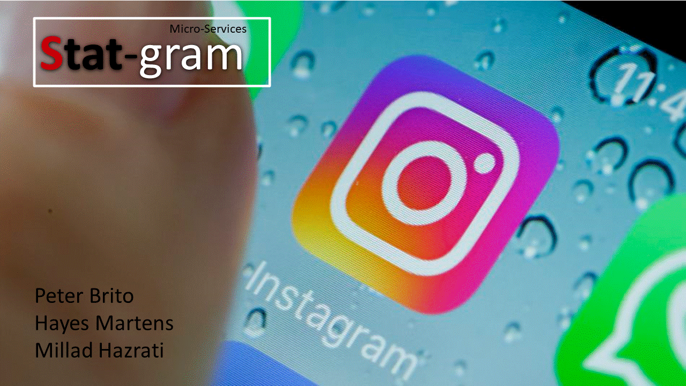

# Background

Stat-gram is microservice tool for Business and Influencers on Instagram platform that uses AI to help with Marketing and Management.

# Goal

There is a gap on the Market for Analytics tools for Instagram Business/ Influencers, We do want explore it!
All the Analytics tool on Market only cover 2 part of customer acquiring. Leads generation, User Experience,
Meaninful KPIs, Time consulming with Integration with Management tools. Using AI, That is what we do!

# What I done in this Project

* Extract the data
* Trained and tested the Algorithm
* Perfomed transformation into the data to apply Machine learning
* Tested the model with new data. Made adjustments and mproved the model for better accuracy  

* Took a lead on the project and delegate tasks for co-workers (database and primary dashboard)
* Designed the Archtecture of the Product
* Created Data pipeline
* Have the first sketch of the Project

* Created Presentation slides using PowerPoint
* Created Business Oportunity, Business Framework, Business Strategy and Business Model

* Build Front-End page from scratch using reverse-engeneering
* Build Prototype product web-pages using HTML,CSS,Bootstrap

* Developed what are the next goals, resources and time-frame to delivery final product.

# Presentation
<pre>
</pre>

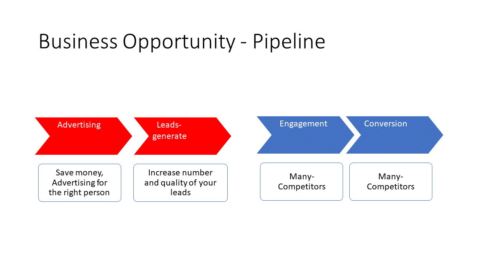

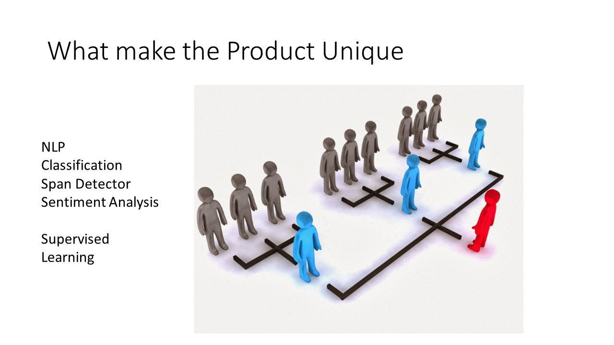

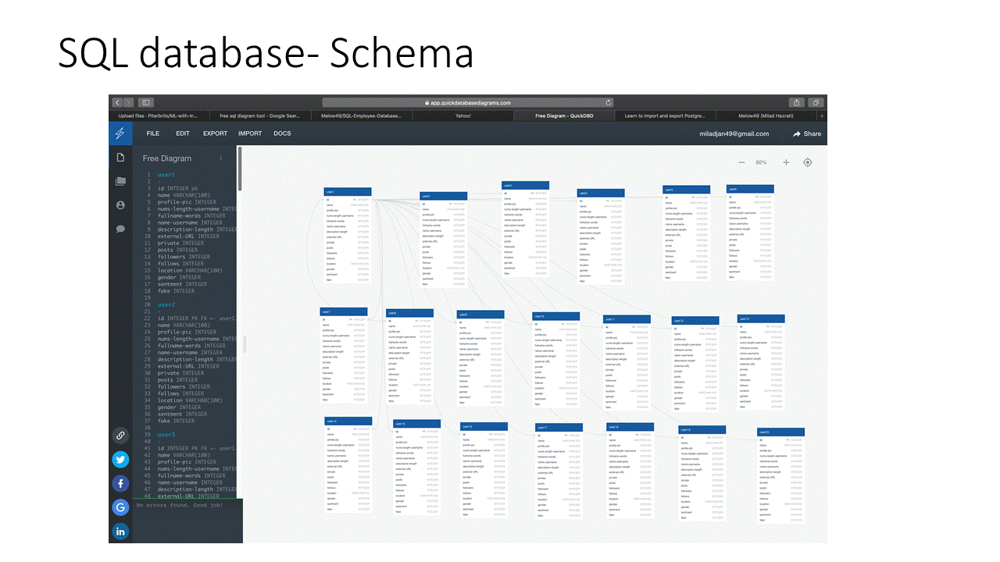

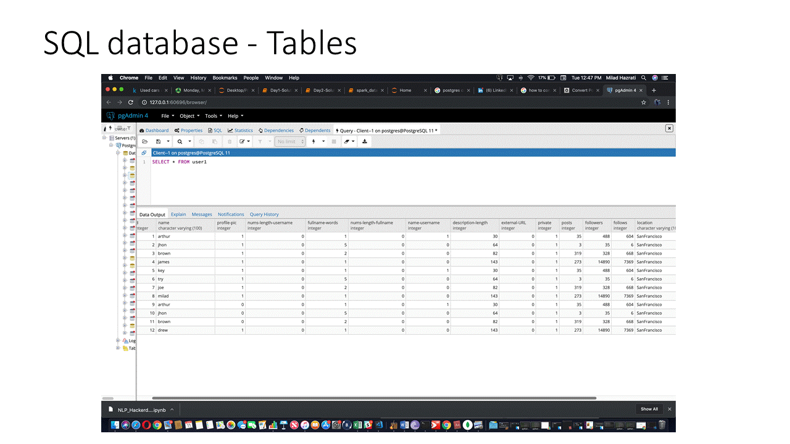

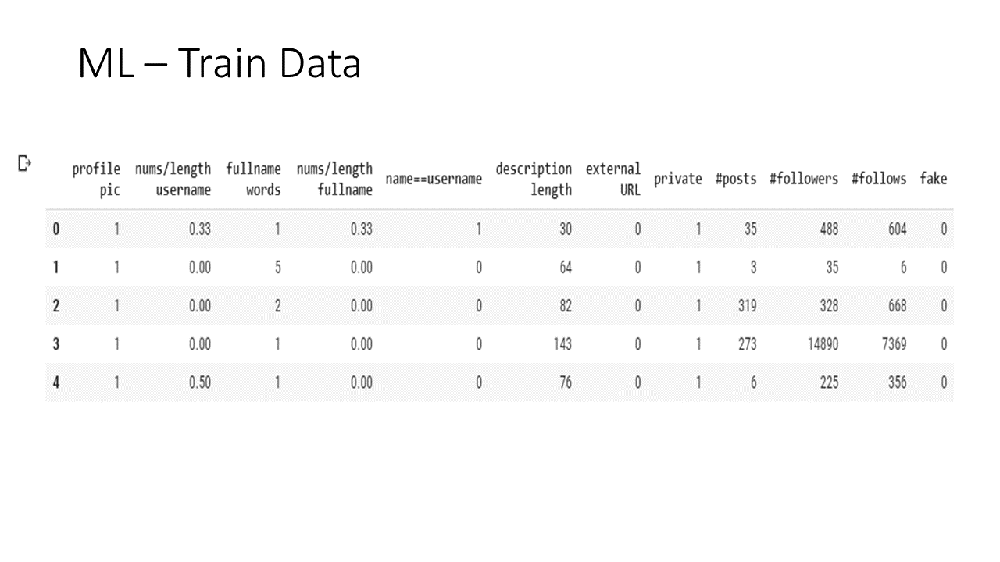

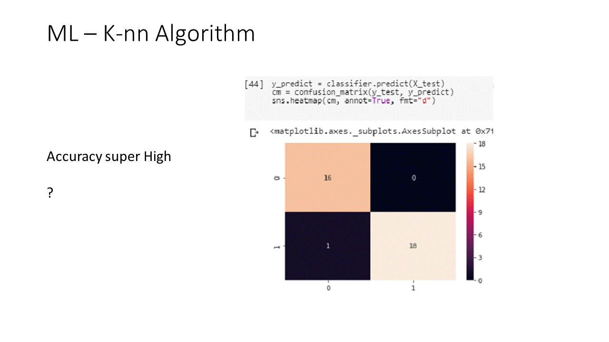

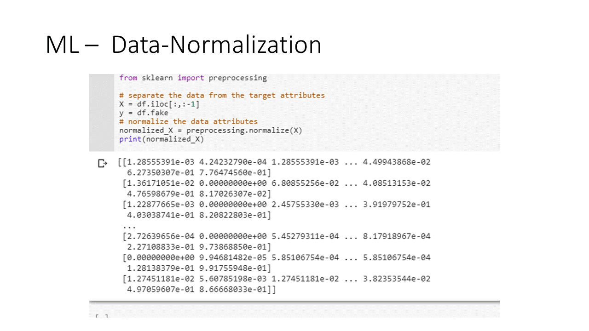

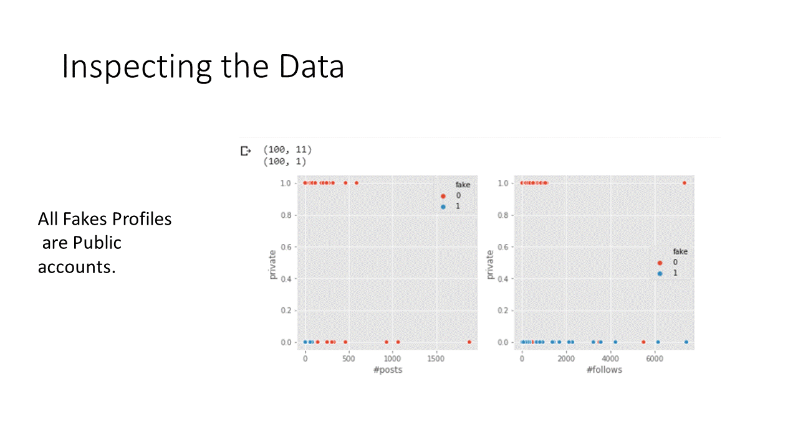

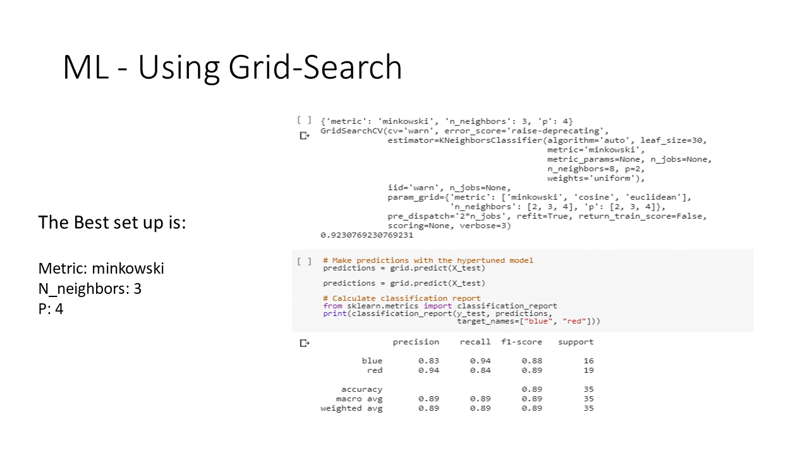

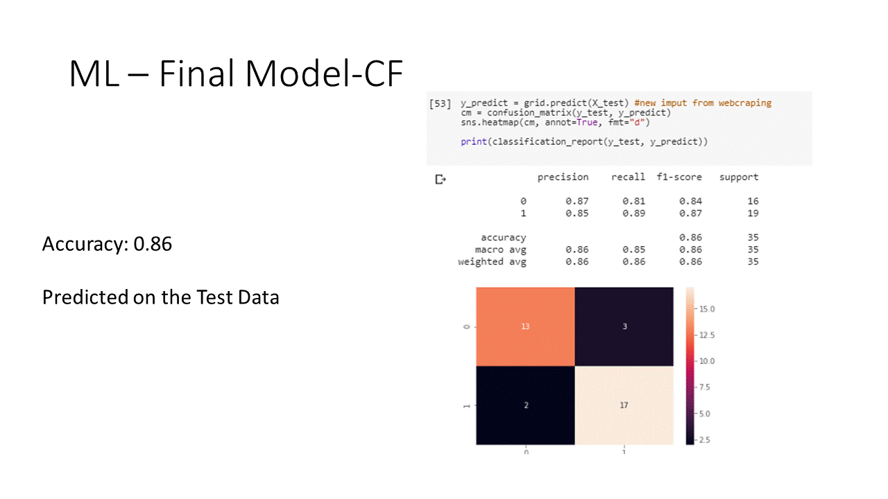

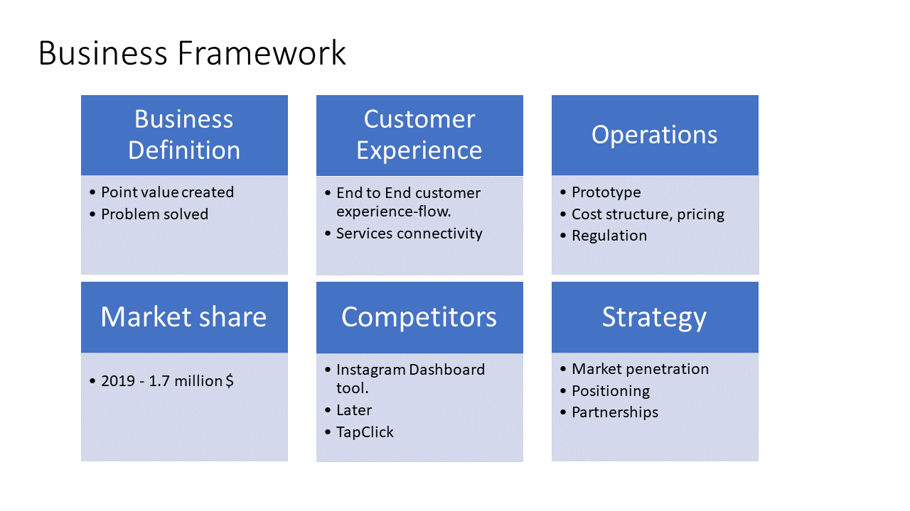

